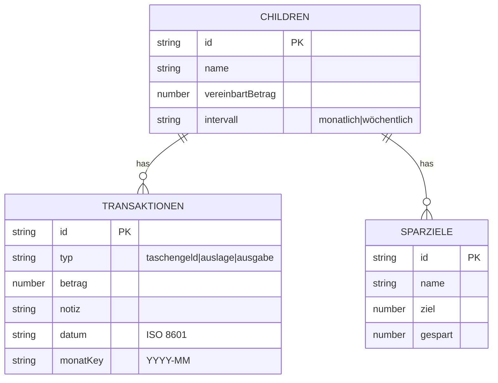

# 001 — Taschengeld App (Reverse Spec)

> **Status:** Rückwärts aus `index.html` @ Commit `main` abgeleitet, ergänzt um UX-Review Mai 2026.
> Das bestehende Verhalten ist die maßgebliche Quelle. Jede widersprechende
> Änderung muss diese Spec im selben Commit aktualisieren.

## 1. Kontext & Tech-Stack

| Aspekt | Wert |
|---|---|
| Typ | Single-Page Vanilla-Web-App, kein Framework, kein Build-Schritt |
| Quelle | `code/index.html` (eine Datei: HTML + CSS + JS, ~493 Zeilen) |
| Backend | Firebase Realtime Database (kostenloser Spark-Plan) |
| DB-URL | `https://taschengeld-b3e94-default-rtdb.europe-west1.firebasedatabase.app` |
| DB-Sicherheit | Test-Modus — öffentliches Lesen/Schreiben, keine Authentifizierung |
| Hosting | GitHub Pages, Branch `main`, Repo `maxiholland/taschengeld` |
| Öffentliche URL | `https://maxiholland.github.io/taschengeld` |
| Zielgerät | Mobil (`max-width: 480px` Container) |
| Sprache | Nur deutsche Benutzeroberfläche |
| Auth | 4+ stellige PIN, gespeichert in `localStorage` (`tg-pin`) auf dem Elterngerät |

Die Codebasis folgt drei Konventionen, die jede Änderung bewahren muss:

- Eine einzige `index.html`. Kein Bundler, keine node_modules, keine separaten CSS/JS-Dateien.
- Imperatives DOM-Building über einen kleinen `h(tag, attrs, children)` Helper — kein JSX, keine Templates.
- Mutabler globaler `S`-Objekt hält den vollständigen UI-Zustand. Jede Interaktion aktualisiert `S` und ruft `render()` auf.

## 2. Ziele (Wozu das existiert)

- Ein Taschengeld-Tracker für eine Familie mit einem oder mehreren Kindern.
- Ein Elterngerät (PIN-geschützt) für die vollständige Buchführung.
- Kinder greifen von ihrem eigenen Gerät auf eine gemeinsame, weitgehend lesegeschützte Ansicht zu; sie können ihre eigenen Ausgaben erfassen und Sparziele verwalten.
- Kein Anmelden, keine Kontoverwaltung, keine laufenden Kosten.

## 3. Nicht im Scope / Anti-Ziele

- Multi-Familien- / Multi-Mandanten-Setups.
- Echte Authentifizierung (OAuth, Benutzerkonten, Passwort-Hashing).
- Native mobile App, PWA-Installation, Push-Benachrichtigungen.
- Offline-Modus / Sync-Konfliktauflösung.
- Geldüberweisungen zwischen Kindern.
- Internationalisierung (Deutsch ist fest codiert).
- Barrierefreiheit jenseits des Standard-Browser-Verhaltens.
- Revisionsprotokoll / Versionshistorie von Bearbeitungen.
- Kind-spezifische Privatsphäre zwischen Geschwistern (alle Kinder sehen alle Geschwister — Entscheidung D-014).

## 4. Rollen & Ansichten

### Eltern (nach PIN-Eingabe via `/?eltern`)

- `S.mode = "eltern"`
- Kann: Kinder hinzufügen/entfernen, `vereinbartBetrag` und `intervall` bearbeiten, Kind umbenennen (Tipp auf Name — D-016), `taschengeld`- und `auslage`-Transaktionen erfassen, diese beiden Typen löschen (mit Undo-Toast — D-011), Monate frei navigieren (vorwärts begrenzt auf aktuellen Monat), QR-Code und Direkt-Link pro Kind anzeigen (D-017).
- Kann nicht: `ausgabe`-Transaktionen löschen. Kann keine Sparziele löschen.

### Kind (via `/?kind={id}` nach PIN-Eingabe)

- `S.mode = "kind"`, `S.activeKindId = "{id}"`
- Sieht **nur die eigene** Karte — keine Geschwister (D-014 revidiert, D-018).
- Sieht Statistiken, Taschengeld-Fortschritt, eigene Ausgaben, Sparziele.
- Kann: eigene `ausgabe`-Transaktionen erfassen **und löschen** (Undo-Toast — D-012), Sparziele erstellen, ein Ziel um 1/2/5 € oder freien Betrag erhöhen (D-013), eigenen PIN ändern.
- Kann nicht: `vereinbartBetrag` oder `intervall` ändern, `taschengeld`/`auslage` erfassen, Daten anderer Kinder sehen oder bearbeiten, Ziele löschen.

### Root-URL `/` (ohne Parameter)

Zeigt eine neutrale Einstiegsseite: Liste der Kindnamen (keine Beträge, keine Transaktionen) als Tipp-Buttons. Tipp auf einen Namen → PIN-Prompt → Kindansicht. Dient als Fallback falls ein Kind die direkte `?kind=ID`-URL nicht gespeichert hat. Kein 🔒-Button — Elternansicht ist nur via `/?eltern` erreichbar (D-019).

### URL-Schema (Gesamtübersicht)

| URL | Ansicht | Schutz |
|---|---|---|
| `/` | Kindauswahl (nur Namen) | keiner |
| `/?kind={id}` | Einzelkind-Ansicht | Kind-PIN (localStorage) |
| `/?eltern` | Elternansicht | Eltern-PIN (localStorage) |

## 5. Datenmodell

Der gesamte App-Zustand liegt unter `/taschengeld.json` als ein JSON-Objekt. Lesen = `GET`, Schreiben = `PUT` (vollständige Überschreibung).

```json
{
  "children": [
    {
      "id": "1715812345678",
      "name": "Luisa",
      "vereinbartBetrag": 20,
      "intervall": "monatlich",
      "transaktionen": [
        {
          "id": "1715812400000",
          "typ": "taschengeld",
          "betrag": 5.00,
          "notiz": "Bargeld Mai",
          "datum": "2025-05-01T00:00:00.000Z",
          "monatKey": "2025-05"
        }
      ],
      "sparziele": [
        {
          "id": "1715812500000",
          "name": "Fahrrad",
          "ziel": 80,
          "gespart": 15
        }
      ]
    }
  ]
}
```

Feldregeln:

- `id` ist `Date.now().toString()` zum Erstellungszeitpunkt. Kollisionen sind theoretisch möglich, aber in der Praxis nicht beobachtet (Elterneingabe auf einem Gerät).
- `typ` ist eines von `"taschengeld" | "auslage" | "ausgabe"`. Siehe §6.
- `monatKey` ist `"YYYY-MM"` und ist das, womit der Monatsfilter vergleicht, **nicht** `datum`. `monatKey` wird aus dem gewählten Datum abgeleitet, wenn das Formular ein Datumsfeld hatte; sonst aus dem aktuell angezeigten Monat.
- `vereinbartBetrag` (früher `monatlBetrag`) ist die Zahl in Euro **pro Zahlungsintervall**. Für `intervall = "wöchentlich"` ist es der Wochenbetrag. Rückwärtskompatibilität: fehlendes `intervall` wird als `"monatlich"` behandelt; fehlendes `vereinbartBetrag` fällt auf `monatlBetrag` zurück (sofern vorhanden).
- `intervall` ist `"monatlich" | "wöchentlich"`. Standard: `"monatlich"`.
- Benutzereingaben für Beträge akzeptieren sowohl `,` als auch `.` als Dezimaltrennzeichen; `parseFloat` wird nach `replace(",", ".")` aufgerufen.
- `sparziele[].gespart` wird serverseitig auf `ziel` begrenzt via `Math.min(ziel, gespart + increment)`.
- **Kind-PIN:** Wird **nicht** in Firebase gespeichert. Liegt ausschließlich in `localStorage["tg-kid-pin-{id}"]` auf dem Gerät des Kindes (D-018). Kein PIN-Feld im Firebase-Datenmodell.



## 6. Fachlogik

### 6.1 Transaktionstypen

| Typ | Erstellt von | Zählt gegen Taschengeld? | Beeinflusst `Verfügbares Bargeld`? | Löschbar durch Eltern? | Löschbar durch Kind? |
|---|---|---|---|---|---|
| `taschengeld` | Eltern — „Bargeld ausgezahlt" | ja (+ zu `elternGesamt`) | ja (+ zu `ausgezahlt`) | ja (Undo-Toast) | nein |
| `auslage` | Eltern — „Auslage verbuchen" | ja (+ zu `elternGesamt`) | nein | ja (Undo-Toast) | nein |
| `ausgabe` | Kind — „+ Ausgabe eintragen" | nein | ja (− von `verfuegbar`) | nein | ja (Undo-Toast, nur eigene) |

### 6.2 Monatliche Statistiken pro Kind (`calcStats(c, mk)`)

Für Kind `c` und Monatsschlüssel `mk`:

```
txs           = c.transaktionen gefiltert nach monatKey === mk
ausgezahlt    = Summe(txs wo typ = "taschengeld")
auslagen      = Summe(txs wo typ = "auslage")
ausgaben      = Summe(txs wo typ = "ausgabe")
elternGesamt  = ausgezahlt + auslagen
vereinbart    = vereinbartProMonat(c, mk)   // siehe 6.3
carryOver     = getCarryOver(c, mk)          // siehe 6.4
netOffen      = vereinbart - carryOver - elternGesamt
offen         = max(0, netOffen)
verfuegbar    = max(0, ausgezahlt - ausgaben)
```

### 6.3 Vereinbarter Monatsbetrag (`vereinbartProMonat(c, mk)`)

Wandelt den Intervall-Betrag in einen Monatsbetrag um:

```
wenn c.intervall === "monatlich" (oder fehlt):
    return c.vereinbartBetrag (oder c.monatlBetrag als Fallback)

wenn c.intervall === "wöchentlich":
    return c.vereinbartBetrag * 4
```

**Hinweis:** Der Faktor 4 ist eine bewusste Vereinfachung (D-010). Manche Monate haben 4,3 Wochen. Für eine Familien-App ist die Abweichung (~1,30 € bei 3 €/Woche) akzeptabel. Eine präzise Variante (ISO-Wochen zählen) ist als D-OQ-5 offen.

### 6.4 Übertrag (`getCarryOver(c, beforeMk)`)

**Zielverhalten** (Entscheidung D-007): Jeder Monat zwischen dem Erstellungsdatum
des Kindes und `beforeMk` trägt bei, *ob er Transaktionen hat oder nicht*.
Monate ohne Aktivität addieren einen vollen `vereinbartProMonat` als Guthaben des Kindes.

```
debt = 0
firstMk = monatKey von c.id (= Erstellungs-Timestamp, Format "YYYY-MM")
für jeden Monatsschlüssel mk von firstMk bis (ausschließlich) beforeMk:
    el = Summe(txs in mk wo typ in ("taschengeld","auslage"))
    debt = debt + el - vereinbartProMonat(c, mk)
return debt
```

Ein negativer `debt` bedeutet, das Kind hat Guthaben. Ein positiver `debt` bedeutet,
die Eltern haben mehr als vereinbart bezahlt (Überschuss, der verrechnet wird).

> **Aktuelle Implementierung weicht ab.** `getCarryOver` in `index.html`
> iteriert nur Monate, die mindestens eine Transaktion haben.
> Inaktive Monate werden übersprungen, was das Guthaben des Kindes unterschätzt.
> Task **B2** in `TASKS.md` existiert, um das zu beheben.

### 6.5 Monatsnavigation

- Gespeichert als `S.month = "YYYY-MM"`, Standard = aktueller Monat.
- Vorwärts-Schritt deaktiviert wenn `S.month === todayKey()`. Keine weitere Obergrenze.
- Rückwärts unbegrenzt.

### 6.6 Eltern-PIN-Zustandsautomat (unverändert)

```mermaid
stateDiagram-v2
    [*] --> root: Seitenaufruf /
    root --> kind_pin: Klick auf Kindname → /?kind={id}
    root --> eltern_pin: /?eltern aufgerufen
    eltern_pin --> set_eltern_pin: kein tg-pin in localStorage
    eltern_pin --> enter_eltern_pin: tg-pin vorhanden
    set_eltern_pin --> eltern: pin.length >= 4 → speichern
    set_eltern_pin --> set_pin_err: pin.length < 4
    enter_eltern_pin --> eltern: pin === savedPin
    enter_eltern_pin --> enter_pin_err: pin !== savedPin
    enter_pin_err --> enter_eltern_pin: nochmal versuchen
    enter_eltern_pin --> set_eltern_pin: "PIN vergessen"
    eltern --> root: "🔒 Abmelden"
    eltern_pin --> root: "Abbrechen"
```

### 6.7 Kind-PIN-Zustandsautomat (neu, D-018)

```mermaid
stateDiagram-v2
    [*] --> url_check: /?kind={id} aufgerufen
    url_check --> kind_not_found: ID nicht in data.children
    url_check --> pin_check: ID gefunden
    kind_not_found --> root: Hinweis + Link zur Startseite
    pin_check --> set_kind_pin: kein tg-kid-pin-{id} in localStorage
    pin_check --> enter_kind_pin: PIN vorhanden
    set_kind_pin --> kind: pin.length >= 4 → in localStorage speichern
    set_kind_pin --> set_pin_err: pin.length < 4
    set_pin_err --> set_kind_pin: weiter tippen
    enter_kind_pin --> kind: pin === savedKindPin
    enter_kind_pin --> enter_pin_err: pin !== savedKindPin
    enter_pin_err --> enter_kind_pin: nochmal versuchen (Eingabe geleert)
    enter_kind_pin --> set_kind_pin: "PIN vergessen" → localStorage-Key löschen
    kind --> root: "Abmelden" (Session-Flag löschen)
```

**Hinweis zu „PIN vergessen":** Da die URL `?kind={id}` selbst der Identitätsbeweis ist (nur das Kind hat sie gespeichert), reicht es, den localStorage-Eintrag zu löschen und einen neuen PIN festlegen zu lassen. Kein weiterer Faktor nötig — wer die URL hat, darf auch den PIN zurücksetzen (D-018).

### 6.7 Undo-Toast

Gilt für alle Löschaktionen (Eltern: `taschengeld`/`auslage` löschen; Kind: eigene `ausgabe` löschen — D-011, D-012):

```
Nutzer tippt ×-Button
  → Transaktion wird sofort aus S.data entfernt
  → PUT /taschengeld.json (optimistisch)
  → Undo-Toast erscheint: "Gelöscht · Rückgängig" (5 Sekunden)
  → Klick auf "Rückgängig": Transaktion wird wiederhergestellt, PUT erneut
  → Nach 5 Sekunden ohne Klick: Toast verschwindet, Löschung ist final
```

Der Toast wird über die normale Status-Pille hinaus als separates Element gerendert. Pro Ansicht ist maximal ein offener Undo-Toast möglich; eine neue Löschaktion ersetzt den alten Toast (vorherige Löschung wird final).

## 7. UI / Layout

Mobile-first, einspaltig, max. 480px Breite, zentriert.

### 7.1 Root-URL-Wireframe (`/`)

```
+----------------------------------------+
|  Taschengeld                           |
+----------------------------------------+
|  ● Gespeichert in Firebase             |
+----------------------------------------+
|                                        |
|   Wer bist du?                         |
|                                        |
|   [  Luisa  ]                          |
|   [  Felix  ]                          |
|                                        |
+----------------------------------------+
```

- Zeigt nur Kindnamen, keine Beträge oder Transaktionen.
- Tipp auf Namen → navigiert zu `/?kind={id}` → PIN-Prompt.
- Kein 🔒-Button (Elternansicht nur via `/?eltern` erreichbar).

### 7.2 Kindansicht-Wireframe (`/?kind={id}`)

```
+----------------------------------------+
|  Taschengeld          ‹ Mai 2026 ›     |
+----------------------------------------+
|  ● Gespeichert in Firebase             |
+----------------------------------------+
| +--------------------------------+     |
| | (LU) Luisa     20,00 € / Monat |     |
| +--------------------------------+     |
| | Noch zu     | Verfügbares      |     |
| | bekommen    | Bargeld          |     |
| |    8,00 €   |    3,50 €        |     |
| +--------------------------------+     |
| | Taschengeld verrechnet         |     |
| | [██████░░░░] 60%               |     |
| | Bargeld 5€  Auslagen 7€        |     |
| +--------------------------------+     |
| | Meine Ausgaben         1,50 €  |     |
| | Kino           −1,50 €  [×]    |     |
| | [+ Ausgabe eintragen]          |     |
| +--------------------------------+     |
| | Sparziele                      |     |
| | Fahrrad      15 / 80 €         |     |
| | [████░░░░░░]                   |     |
| | [+1€] [+2€] [+5€] [____€ ✓]   |     |
| | [+ Sparziel hinzufügen]        |     |
| +--------------------------------+     |
|                                        |
|  [Abmelden]        [PIN ändern]        |
+----------------------------------------+
```

- Zeigt **nur das eigene Kind** — keine Geschwister.
- `ausgabe`-Zeilen zeigen `[×]`-Button (Undo-Toast — D-012).
- Sparziel-Freifeld `[____€ ✓]` neben Schnell-Buttons (D-013).
- Intervall-Anzeige: „20,00 € / Monat" oder „5,00 € / Woche".
- „Abmelden" löscht Session-Flag, kehrt zu `/` zurück.
- „PIN ändern" öffnet PIN-setzen-Flow (alter PIN bestätigen → neuer PIN).

### 7.3 Eltern-Startansicht-Wireframe

```
+----------------------------------------+
| ‹ Mai 2026 ›             🔒 Abmelden   |
+----------------------------------------+
| ● Gespeichert in Firebase              |
+----------------------------------------+
| +--------------------------------+     |
| | (LU) Luisa            offen    |     |
| | 20€/Monat · ausg. 3€   8,00 €  |     |
| | [██████░░░░]                   |     |
| | Bargeld 5€  Auslagen 7€        |     |
| +--------------------------------+     |
| | (FE) Felix     ...             |     |
| +--------------------------------+     |
| [+ Kind hinzufügen]                    |
+----------------------------------------+
```

### 7.4 Eltern-Kinddetail-Wireframe

```
+----------------------------------------+
| ←         ‹ Mai 2026 ›                 |
+----------------------------------------+
| ● Gespeichert in Firebase              |
+----------------------------------------+
| Name: [Luisa ✎]                        |
+----------------------------------------+
| Vereinbart ✎     |   Bargeld           |
|  20,00 €/Monat ▾ |    5,00 €           |
+----------------------------------------+
| Auslagen         |   Kind ausgegeben   |
|    7,00 €        |    1,50 €           |
+----------------------------------------+
| Übertrag aus Vormonat        −2,00 €   |
+----------------------------------------+
| Verrechnet 12 €   Noch offen: 8,00 €   |
| [████████░░░░]                         |
+----------------------------------------+
| [Bargeld ausgezahlt] [Auslage verbuchen]|
+----------------------------------------+
| Transaktionen Mai 2026                 |
| [Bargeld] Mai-Auszahlung 01.05  5,00 € [×] |
| [Auslage] Turnschuhe    03.05   7,00 € [×] |
| [Kind]    Kino          05.05   1,50 €     |
+----------------------------------------+
```

Änderungen gegenüber vorheriger Version:
- `Name: [Luisa ✎]` — Tipp öffnet Inline-Editfeld für den Namen (D-016).
- `Vereinbart ✎` zeigt Betrag + Intervall-Label, Tipp öffnet Modal mit Betrag-Feld + Intervall-Auswahl `[Monatlich ▾]` / `[Wöchentlich]` (D-010).
- `[Kind]`-Zeilen haben keinen `[×]`-Button (unverändert).

### 7.5 QR-Code-Bereich in Eltern-Kinddetail

```
+----------------------------------------+
| ←         ‹ Mai 2026 ›                 |
+----------------------------------------+
| ...  (Statistiken, Transaktionen)      |
+----------------------------------------+
| Kind-Link teilen                       |
| [████████████]  ← QR-Code              |
| [████████████]                         |
| https://…/taschengeld?kind=1715…  [📋] |
+----------------------------------------+
```

- QR-Code wird inline im Browser gerendert (qrcode.js via CDN — D-020).
- Kopier-Button `[📋]` kopiert die URL in die Zwischenablage.
- Eltern zeigen diesen Bereich ihrem Kind → Kind scannt mit eigenem Handy.
- Kein separates Modal — der Bereich ist am Ende der Detailansicht.

### 7.6 Leerer Ersteinstieg / Onboarding-Wireframe

Sichtbar wenn `data.children` leer oder `null` und `S.mode = "eltern"` (D-015):

```
+----------------------------------------+
| ‹ Mai 2026 ›             🔒 Abmelden   |
+----------------------------------------+
| ● Gespeichert in Firebase              |
+----------------------------------------+
|                                        |
|   Noch keine Kinder angelegt.          |
|   Fang hier an:                        |
|                                        |
|   [+ Erstes Kind hinzufügen]           |
|                                        |
+----------------------------------------+
```

Root-URL (`/`) mit leerem Datensatz:

```
+----------------------------------------+
|  Taschengeld                           |
+----------------------------------------+
|   Hier gibt es noch nichts zu sehen.   |
|   Bitte deine Eltern, die App          |
|   einzurichten.                        |
+----------------------------------------+
```

### 7.7 Undo-Toast-Wireframe

```
+----------------------------------------+
|  [Transaktion gelöscht · Rückgängig]   |  ← erscheint 5 Sek. am unteren Rand
+----------------------------------------+
```

- Toast ist `position: fixed; bottom: 16px` über dem normalen Layout.
- Farbe: Dunkelgrau (#333), weiße Schrift, abgerundete Ecken.
- „Rückgängig" ist ein unterstrichener Tap-Bereich.
- Schließt sich nach 5 Sekunden automatisch oder sofort nach Tap auf „Rückgängig".

### 7.6 Farbpalette

Sechs Pastell-Paare, rotierend nach Kind-Index (`COLS[i % 6]`):

| # | bg | text | bar |
|---|---|---|---|
| 0 | #e6f1fb | #042c53 | #378add (blau) |
| 1 | #e1f5ee | #04342c | #1d9e75 (grün) |
| 2 | #fbeaf0 | #4b1528 | #d4537e (pink) |
| 3 | #faeeda | #412402 | #ba7517 (orange) |
| 4 | #eeedfe | #26215c | #7f77dd (lila) |
| 5 | #faece7 | #4a1b0c | #d85a30 (rot) |

Statusfarben:
- Speichern: `#ba7517` (amber)
- Fehler: `#c0392b` (rot)
- Erfolg: `#1d9e75` (grün)
- Überschuss (Schulden): Balken wird `#ef9f27`, Text `#833b0a`
- Undo-Toast: `#333333` Hintergrund, `#ffffff` Text

## 8. Sync / I/O

```mermaid
sequenceDiagram
    participant U as Benutzer
    participant UI as Browser (S, render())
    participant FB as Firebase REST
    U->>UI: Aktion (z. B. Transaktion hinzufügen)
    UI->>UI: S.data = next; S.saving = true; render()
    UI->>FB: PUT /taschengeld.json (gesamter Baum)
    alt Erfolg
        FB-->>UI: 200
        UI->>UI: S.saving = false; render()
    else Fehler
        FB-->>UI: non-2xx
        UI->>UI: S.saveErr = true; render()
    end
```

Hinweise zur Nebenläufigkeit:
- **Keine optimistische Nebenläufigkeitskontrolle.** Zwei Elternteile, die gleichzeitig editieren, überschreiben sich gegenseitig stillschweigend (letztes `PUT` gewinnt).
- Das initiale `fbLoad` läuft einmal beim Seitenaufruf. Es gibt kein Live-Abonnement; Änderungen von einem anderen Gerät sind erst nach manuellem Seitenneuladen sichtbar.

## 9. Abnahmekriterien

Diese spiegeln das aktuell beobachtete Verhalten wider plus neue Features. Der Implementierer muss sie bewahren, solange diese Spec nicht aktualisiert wird.

### A1 — Speichern & Laden
- Beim Seitenaufruf zeigt die App „Lade Daten…", bis `GET /taschengeld.json` aufgelöst ist.
- Bei jeder Zustandsmutation wird ein `PUT /taschengeld.json` gesendet, und die Status-Pille reflektiert: speichern → gespeichert oder gespeichert → Fehler.
- Ein fehlgeschlagener PUT lässt den lokalen Zustand intakt und zeigt die rote „Speichern fehlgeschlagen"-Pille.

### A2 — Kind hinzufügen
- Leeres Namensfeld → Speichern-Button tut nichts.
- `vereinbartBetrag` akzeptiert `20`, `20.5`, `20,5`. Nicht-numerische Eingabe fällt auf `0` zurück.
- `intervall` ist ein Pflichtfeld im Anlegen-Modal mit zwei Optionen: „Monatlich" und „Wöchentlich". Standard: „Monatlich".
- Eltern-Startansicht zeigt unter dem Betrag das Intervall-Label: „€/Monat" oder „€/Woche".

### A3 — Transaktionen erfassen
- `Betrag` muss nach `parseFloat(value.replace(",","."))` `> 0` sein, sonst tut das Modal beim Speichern nichts.
- `Datum` ist optional. Falls weggelassen, wird `new Date()` verwendet und `monatKey` entspricht dem aktuell angezeigten Monat.
- Falls ein Datum angegeben wird, wird `monatKey` aus `date.slice(0,7)` abgeleitet.

### A4 — Monatsnavigation
- `‹` ist immer aktiviert.
- `›` ist deaktiviert wenn `S.month === todayKey()`.

### A5 — Übertrag
- Wenn `elternGesamt > vereinbartProMonat` in einem Monat, wird der Überschuss von `netOffen` in Folgemonaten abgezogen, bis er verrechnet ist.
- Wenn ein Monat keine Transaktionen hat, akkumuliert der volle `vereinbartProMonat` als Guthaben des Kindes (Zielverhalten gemäß D-007; siehe B2 für den laufenden Fix).
- Das Übertrags-Banner erscheint in beiden Ansichten wenn `carryOver > 0`.
- Wenn `netOffen < 0`, zeigt die Kindkarte `"X € werden vom nächsten Monat abgezogen"` und der Fortschrittsbalken wird amber `#ef9f27`.

### A6 — Sparziele
- `+1/+2/+5`-Buttons begrenzen auf `ziel` und überschreiten ihn nie.
- Freies Eingabefeld neben den Schnell-Buttons: akzeptiert Dezimalbeträge, begrenzt ebenfalls auf `ziel`, wird nach Bestätigung (Tipp auf ✓ oder Enter) geleert.
- Wenn `gespart >= ziel`, werden die Erhöhungs-Buttons und das Freifeld ausgeblendet und `"🎉 Ziel erreicht!"` angezeigt.
- Neues Ziel erfordert einen nicht-leeren Namen. Ungültige `ziel`-Eingabe → `0` (absichtlich erlaubt per D-008).

### A7 — Eltern-PIN (unverändert)
- Erste Eingabe ohne `savedPin`: setzt PIN bei `>=4` Zeichen, sonst wird „Mindestens 4 Stellen." angezeigt.
- Falsche PIN: Eingabe leeren, „Falsche PIN." anzeigen.
- „PIN vergessen – neu festlegen": nur sichtbar wenn bereits eine PIN gesetzt ist; löscht `localStorage["tg-pin"]` und wechselt in den PIN-setzen-Modus.
- PIN wird nie ans Backend gesendet.

### A11 — URL-Routing
- `/` → Root-Ansicht: Kindnamen als Tipp-Buttons, kein 🔒-Button.
- `/?kind={id}` mit gültiger ID → Kind-PIN-Flow (A12), dann Einzelkind-Ansicht.
- `/?kind={unbekannte-id}` → Hinweis „Kind nicht gefunden" + Link zur Startseite.
- `/?eltern` → Eltern-PIN-Flow (A7), dann Elternansicht.
- Navigation zwischen Ansichten ändert jeweils die URL korrekt.

### A12 — Kind-PIN (selbst gesetzt, D-018)
- Erstes Öffnen von `/?kind={id}` ohne `localStorage["tg-kid-pin-{id}"]`: „Leg deinen PIN fest"-Modal erscheint.
- PIN-Eingabe < 4 Zeichen → „Mindestens 4 Stellen." Kein Speichern.
- PIN ≥ 4 Zeichen → in `localStorage["tg-kid-pin-{id}"]` speichern → Kindansicht öffnen.
- Spätere Öffnungen: „Deinen PIN eingeben"-Modal erscheint.
- Falsche PIN → Eingabe leeren, „Falsche PIN." anzeigen.
- „PIN vergessen": `localStorage["tg-kid-pin-{id}"]` löschen → PIN-setzen-Flow. Kein weiterer Faktor (URL ist Identitätsbeweis).
- „PIN ändern" in der Kindansicht: alten PIN bestätigen → neuen PIN setzen.
- Kind-PIN wird nie an Firebase gesendet.

### A13 — QR-Code-Sharing
- In der Eltern-Detailansicht erscheint am Ende ein „Kind-Link teilen"-Bereich.
- QR-Code zeigt die vollständige `/?kind={id}`-URL.
- Kopier-Button kopiert URL in die Zwischenablage, zeigt kurze Bestätigung „Kopiert!".
- QR-Code wird client-seitig via qrcode.js (CDN) gerendert, kein Server nötig.

### A8 — Transaktionen löschen (mit Undo)
- Eltern sehen `×`-Button bei `taschengeld`- und `auslage`-Zeilen.
- Kind sieht `×`-Button bei eigenen `ausgabe`-Zeilen (nur eigene, nicht die anderer Kinder).
- `ausgabe`-Zeilen in der Elterndetailansicht haben keinen `×`-Button.
- Tipp auf `×` entfernt die Transaktion sofort aus der Ansicht, sendet PUT, zeigt Undo-Toast für 5 Sekunden.
- Tipp auf „Rückgängig" im Toast stellt die Transaktion wieder her und sendet erneut PUT.
- Nach Ablauf der 5 Sekunden: Toast verschwindet, Löschung ist final.
- Pro Ansicht ist maximal ein offener Undo-Toast aktiv; eine neue Löschaktion überschreibt den vorherigen Toast (vorherige Löschung wird final).

### A9 — Leerer Ersteinstieg
- Wenn `data.children` leer oder `null` und `S.mode = "eltern"`: Leerer-Zustand-Hinweis mit Primär-CTA „+ Erstes Kind hinzufügen" anstelle der leeren Kindliste.
- Wenn `data.children` leer oder `null` und `S.mode = "kind"`: Freundlicher Hinweistext „Hier gibt es noch nichts zu sehen. Bitte deine Eltern, die App einzurichten." — kein 🔒-Button sichtbar (verhindert Verwirrung).

### A10 — Kind umbenennen
- In der Eltern-Detailansicht eines Kindes ist der Name als `[Luisa ✎]` dargestellt.
- Tipp auf Name oder ✎-Icon öffnet ein Inline-Textfeld (vorbelegt mit aktuellem Namen).
- Leeres Namensfeld → Speichern tut nichts.
- Bestätigung via Enter oder Tipp auf ✓-Button: Name wird aktualisiert, PUT gesendet.
- Abbrechen via Escape oder Tipp außerhalb des Feldes: Name bleibt unverändert.

## 10. Nicht-funktionale Anforderungen

- **Performance-Budget**: Datensatz ist klein (≤ einige Hundert Transaktionen pro Kind pro Jahr). Keine Pagination nötig. Vollständiges Re-Render bei jeder Interaktion ist akzeptabel.
- **A11y**: Derzeit kein Ziel. Keine Tastaturnavigationsgarantien, keine ARIA-Labels, Fehlerzustände nur durch Farbe.
- **i18n**: Nur Deutsch, Strings inline. Keine Übersetzungsinfrastruktur.
- **Browser-Unterstützung**: Moderne Evergreen-Browser (Chrome, Safari, Firefox, Edge). Verwendet `Intl.NumberFormat`, `fetch`, async/await, Optional Chaining, Nullish Coalescing.
- **Datenschutz**: Daten sind in einer öffentlich lesbaren Firebase-Test-DB gespeichert. Die URL ist die einzige Zugangsbeschränkung. Für einen Einzelfamilien-Anwendungsfall, bei dem die URL privat bleibt, akzeptabel.

## 11. Tests

Es gibt derzeit keine automatisierten Tests. Manuelle Smoke-Checkliste (nach jeder Verhaltensänderung ausführen):

| # | Schritt | Erwartet |
|---|---|---|
| T1 | `/taschengeld` in einem privaten Fenster laden | Kindansicht lädt, Status-Pille grün |
| T2 | 🔒 tippen, PIN eingeben | Elternansicht erscheint |
| T3 | Kind „Test" mit 10 €/Monat hinzufügen | Karte erscheint in beiden Ansichten, Label „€/Monat" |
| T4 | Kind „Willi" mit 5 €/Woche hinzufügen | Karte zeigt „5,00 € / Woche", vereinbart/Monat = 20 € |
| T5 | 10 € `taschengeld` für aktuellen Monat buchen | „Noch zu bekommen" → 0 € |
| T6 | 5 € `auslage` buchen | „Noch zu bekommen" bleibt 0 €, „Schulden 5 € → Folgemonat" erscheint |
| T7 | Transaktion via × löschen | Undo-Toast erscheint, Transaktion verschwindet |
| T8 | Innerhalb 5 Sek. „Rückgängig" tippen | Transaktion kehrt zurück |
| T9 | Einen Monat vorwärts, dann zurück | Gleiche Daten wiederhergestellt |
| T10 | Als Kind 3 € Ausgabe hinzufügen | „Verfügbares Bargeld" sinkt um 3 € |
| T11 | Als Kind eigene Ausgabe via × löschen | Undo-Toast, Betrag kehrt zurück nach „Rückgängig" |
| T12 | Sparziel „Eis" 5 € hinzufügen, +1, +2, +5 tippen | Ziel erreicht `ziel`, zeigt 🎉, Buttons verschwinden |
| T13 | Freien Betrag „1,50" ins Sparziel-Freifeld eingeben | `gespart` erhöht sich um 1,50 € |
| T14 | Kind umbenennen via ✎ | Neuer Name erscheint in Eltern- und Kindansicht |
| T15 | Leere DB: Kindansicht aufrufen | Hinweistext erscheint, kein 🔒-Button |
| T16 | Leere DB: Elternansicht aufrufen | Leerer Zustand mit CTA „+ Erstes Kind hinzufügen" |
| T17 | Browser schließen, neu öffnen | Daten bestehen, PIN noch gesetzt |
| T18 | `tg-pin` in localStorage löschen, `/?eltern` öffnen | PIN-setzen-Flow erscheint |
| T19 | `/` öffnen | Kindnamen als Buttons, kein 🔒-Button sichtbar |
| T20 | Auf Kindname tippen | `/?kind={id}` aufgerufen, „Leg deinen PIN fest" erscheint |
| T21 | PIN festlegen, Kindansicht öffnen | Nur eigenes Kind sichtbar, keine Geschwister |
| T22 | Abmelden, erneut `/?kind={id}` öffnen | PIN-Eingabe erscheint (Session-Flag gelöscht) |
| T23 | „PIN vergessen" tippen | localStorage-Key gelöscht, PIN-setzen-Flow |
| T24 | `/?kind={unbekannte-id}` öffnen | „Kind nicht gefunden"-Hinweis |
| T25 | QR-Code in Elterndetailansicht anzeigen | QR-Code sichtbar, Kopier-Button kopiert URL |

Test-Cases sollten zu automatisierten Tests befördert werden, sobald ein Test-Runner eingeführt wird — siehe §13.

## 12. Offene Tasks / Roadmap

Siehe `TASKS.md` für die umsetzbare, priorisierte Liste. Übergeordnete Themen:

- **Priorität 1** (neu, aus UX-Review):
  - Wöchentlicher Zahlungsintervall (T8 in TASKS.md)
  - Undo-Toast statt kein Bestätigungsdialog (T9)
  - Kind kann eigene Ausgaben löschen (T10)
  - Freie Betragseingabe bei Sparzielen (T11)
  - Kind umbenennen (T12)
  - Empty-State / Onboarding (T13)
- **Priorität 1** (aus vorheriger Spec):
  - URL-basierte Ansichtstrennung (T1)
- **Mögliche Features** (noch nicht spezifiziert):
  - Jahresübersicht für Eltern (Summen pro Kind über alle Monate)
  - Mehrere Kinder auf einer Startseite vergleichen
  - Monatliches Taschengeld am 1. automatisch gutschreiben
  - Browser-Benachrichtigung wenn Taschengeld bereit
  - Ausgaben-Kategorien
  - PDF/CSV-Export

## 13. Bekannte Probleme / Offene Fragen

- **Übertrags-Code entspricht noch nicht der Spec.** §6.4 beschreibt das
  Zielverhalten (inaktive Monate zählen als Guthaben). Das aktuelle
  `getCarryOver` in `index.html` iteriert nur Monate mit Transaktionen.
  Siehe Task **B2** in `TASKS.md`.
- **`Sparziel` mit `ziel = 0` ist absichtlich erlaubt** (Entscheidung D-008).
  Erhöhungs-Buttons zeigen sofort „🎉 Ziel erreicht!". Kein Bug.
- **Keine `id`-Kollisionsbehandlung.** `Date.now()` könnte kollidieren wenn
  zwei Transaktionen in derselben Millisekunde erstellt werden.
- **Kein Test-Framework.** Einen einzuführen (z. B. Vitest gegen eine kleine
  `logic.js`-Extraktion) wäre eine separate Spec.
- **Firebase-DB im Test-Modus.** Langfristig wären gesperrte Regeln + Anonymous
  Auth sicherer.
- **Wöchentlicher Intervall: Wochenzahl-Berechnung vereinfacht.** Faktor 4 statt
  tatsächliche Wochen. Offene Frage D-OQ-5.
- **`monatlBetrag` vs. `vereinbartBetrag`:** Rückwärtskompatibilität erfordert
  Fallback-Lesen beider Feldnamen. Migration via einmaligem PUT beim nächsten
  Kindanlegen ist ausreichend für einen Single-Tenant-Use-Case.

## 14. Definition of Done (für Änderungen an dieser Spec)

Eine Änderung gilt als „done" wenn:
1. Alle Abnahmekriterien aus §9 via der manuellen Checkliste in §11 bestehen.
2. SPEC.md, TASKS.md, DECISIONS.md im selben Commit aktualisiert, wenn sich Verhalten geändert hat.
3. `COMMENTS.md` hat einen `[PENDING]`-Block, der die Änderung beschreibt (siehe `CLAUDE.md`).
4. `./git-sync.sh` läuft erfolgreich (Push landet auf `main`).
5. Die bereitgestellte GitHub Pages URL lädt ohne Fehler und das betroffene Feature ist verifizierbar.

## 15. Rollback-Plan

- Das Repo ist eine einzige Datei. `git revert <commit>` gefolgt von `git push` macht die bereitgestellte Seite sofort rückgängig.
- DB-Schemaänderungen erfordern einen manuellen Export von `/taschengeld.json` vor der Änderung. Dazu den „JSON exportieren"-Button in der Firebase Console verwenden.

## 16. Eskalationsregeln — Wann der Implementierungsagent stoppen und fragen muss

Stopp und Rückfrage stellen (statt raten) wenn:
- Ein neuer Transaktionstyp benötigt wird (`typ` ist derzeit ein Enum aus 3).
- Eine Änderung andere `localStorage`-Schlüssel als `tg-pin` berühren würde.
- Eine Änderung einen Build-Schritt oder eine Abhängigkeit außerhalb der einzelnen HTML-Datei einführen würde.
- Eine Änderung auf einen anderen Firebase-Pfad als `/taschengeld.json` schreiben würde.
- Der Benutzer „alle Daten löschen" oder eine destruktive Operation ohne expliziten Bestätigungsflow anfordert.
- Eine Schemaänderung bestehende Daten ungültig machen würde, ohne dass ein Migrationspfad definiert ist.
