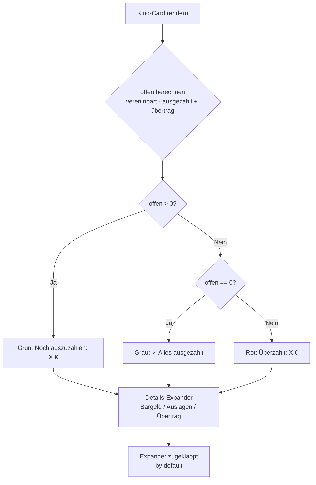
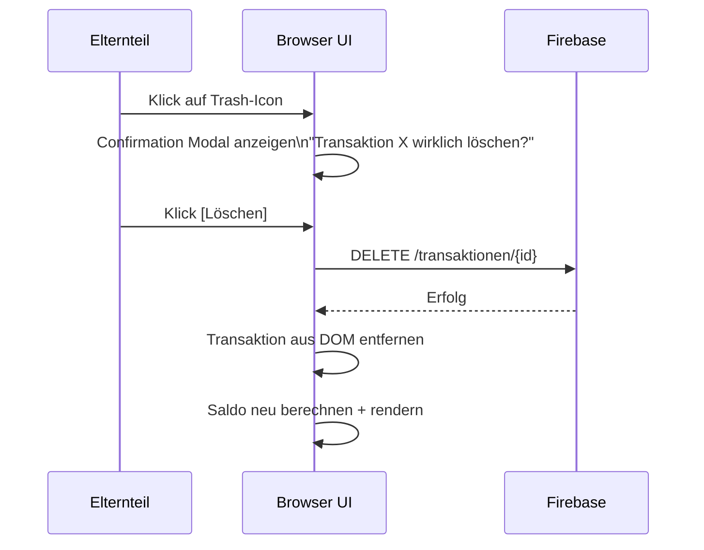

# SPEC 002 — UX-Refactoring Eltern-Ansicht

**Slug:** `ux-refactoring-eltern-ansicht`  
**Erstellt:** 2026-05-22  
**Status:** Ready for Implementation  
**Audit-Basis:** `docs/UX_AUDIT_Taschengeld_App.md`  
**Implementations-Dateien:**
- `02_ux-refactoring-eltern-ansicht_TASKS.md` — Aufgabenliste
- `03_ux-refactoring-eltern-ansicht_PROGRESS.md` — Journal
- `04_ux-refactoring-eltern-ansicht_DECISIONS.md` — Decision Log

---

## §1 Kontext & Ziel

Die Taschengeld-App ist eine Single-File-Webapp (`index.html`) mit Vanilla HTML/CSS/JS und Firebase Realtime DB als Backend. Sie erlaubt Eltern, das Taschengeld für ihre Kinder zu verwalten: Auszahlungen tracken, Auslagen verbuchen, Übertrag aus Vormonaten nachvollziehen.

**Problem:** Ein UX-Audit (2026-05-22) hat **10 signifikante Usability-Probleme** in der Eltern-Ansicht identifiziert. Eltern brauchen im aktuellen Zustand 10+ Sekunden, um die simpelste Frage zu beantworten: „Muss ich meinem Kind jetzt Geld geben?"

**Ziel dieses Refactorings:** Die Eltern-Ansicht so umgestalten, dass Eltern:
1. In ≤3 Sekunden erkennen, ob und wie viel sie einem Kind schulden
2. Keine Fehlinterpretationen durch mehrdeutige Negativ-Saldi haben
3. Nicht versehentlich Transaktionen löschen
4. Die App ohne Handbuch verstehen (kein Tech-Jargon, keine stummen Icons)

---

## §2 Tech-Stack & Konventionen

| Aspekt | Detail |
|--------|--------|
| **Frontend** | Vanilla HTML + CSS + JS, **Single File** (`code/index.html`) |
| **Backend** | Firebase Realtime Database |
| **Hosting** | GitHub Pages |
| **Kein Build-Tool** | Kein npm, kein Webpack — direkt editierbare Datei |
| **Repo** | GitHub, Sync via `./git-sync.sh` (nicht manuell pushen!) |
| **Änderungsdoku** | Nach jeder Änderung Eintrag in `COMMENTS.md` mit Tag `[PENDING]` |
| **Commit-Author** | Maxi Holland \<maxiholland@gmail.com\> — nie Agent-Namen |

**Wichtig für den Agent:**
- Es gibt **keine** separaten CSS- oder JS-Dateien — alles in `index.html`
- Kein CSS-Framework (kein Tailwind, kein Bootstrap) — eigene Stile inline/im `<style>`-Block
- Firebase SDK wird per CDN-Script-Tag eingebunden
- Nach jeder abgeschlossenen Task: Eintrag in `COMMENTS.md` (Format: `## [PENDING] YYYY-MM-DD HH:MM`)

---

## §3 Scope — Was gehört dazu / Was nicht

### In Scope ✅

- Alle 10 UX-Probleme aus dem Audit (Fix #1–#10)
- Nur die **Eltern-Ansicht** (nach PIN-Login)
- CSS-Anpassungen innerhalb von `index.html`
- JS-Logik-Anpassungen innerhalb von `index.html`
- Bestehende Firebase-Datenstruktur bleibt unverändert (nur Darstellung ändert sich)

### Out of Scope ❌

- **Kind-Ansicht** (separater View) — nicht anfassen
- **PIN-Login-Screen** — nicht anfassen
- **Datenbank-Schema-Änderungen** — keine Migrations
- **Backend-Logik** — keine Firebase-Rules-Änderungen
- **Neue Features** (z.B. Push-Notifications, Export-Funktion)
- Fix #11–#14 (Low-Priority-Verbesserungen) — **optional**, nur wenn Zeit bleibt
- Neue Datei-Struktur (bleibt Single File)

---

## §4 Akzeptanzkriterien

Beobachtbares Verhalten aus Eltern-Sicht nach dem Refactoring:

### AC-1: Kognitiver Overload reduziert (Fix #1)
- [ ] Die Kind-Card zeigt maximal **3 Datenfelder** gleichzeitig (Name, Monatsbetrag, Noch-auszuzahlen)
- [ ] „Noch auszuzahlen" ist die **prominenteste** Information auf der Card
- [ ] Alle Detail-Infos (Bargeld, Auslagen, Übertrag) sind in einem Expander versteckt
- [ ] Eltern können in ≤3 Sekunden sagen: „Ich muss [Kind] noch X Euro geben"

### AC-2: Negativ-Saldi verständlich (Fix #2)
- [ ] Kein negativer Betrag erscheint ohne explizite Beschriftung (z.B. „Überzahlt: 9,01 €")
- [ ] Farb-Coding ist konsistent: Grün = Kind bekommt Geld, Rot = Kind hat Schulden, Grau = ausgeglichen
- [ ] In der Jahresübersicht-Tabelle ist klar, was jede Spalte bedeutet

### AC-3: Zeiteinheit immer sichtbar (Fix #3)
- [ ] Auf **allen Screens** zeigt „Vereinbart" die Zeiteinheit: `15,00 € / Monat`
- [ ] Inkonsistenz zwischen Monatsübersicht und Detailansicht ist behoben

### AC-4: Farb-Logik bei 0,00 € korrekt (Fix #4)
- [ ] `0,00 €` ausgegeben → Farbe ist **Grau/Neutral**, nicht Rot
- [ ] Rot nur wenn `ausgegeben > vereinbart`

### AC-5: Button-Hierarchie klar (Fix #5)
- [ ] „Bargeld ausgezahlt" = Primary Button (gefüllt, farbig)
- [ ] „Auslage verbuchen" = Secondary Button (outline, weniger prominent)

### AC-6: Progress Bar bedeutungsvoll (Fix #6)
- [ ] Progress Bar zeigt eindeutig „Ausgezahlt / Vereinbart" mit Prozent-Label
- [ ] **oder** Progress Bar ist entfernt und durch klaren Text ersetzt

### AC-7: Übertrag mit Erklärung (Fix #7)
- [ ] „Übertrag aus Vormonat" hat ein Info-Icon oder ausklappbaren Text
- [ ] Die Erklärung sagt in Klartext: „Kind hat im [Monat] X € zu viel bekommen"
- [ ] Link/Button zu Vormonats-Details vorhanden (wenn technisch möglich)

### AC-8: Löschen mit Bestätigung (Fix #8)
- [ ] Klick auf Löschen-Icon öffnet **entweder** einen Confirmation-Dialog **oder** einen Undo-Toast
- [ ] Kein sofortiges, unwiderrufliches Löschen ohne Nutzer-Bestätigung

### AC-9: QR-Code mit Erklärung (Fix #9)
- [ ] Vor dem QR-Code steht ein erklärender Text: Was kann das Kind damit tun?
- [ ] Was kann das Kind **nicht** tun? (Löschen/Bearbeiten)
- [ ] Button/Label heißt „Kind-App-Zugang" oder ähnlich Beschreibendes (nicht nur „Kind-Link")

### AC-10: Jahresübersicht mobile-tauglich (Fix #10)
- [ ] Die 5-Spalten-Tabelle ist auf Screens <600px gut lesbar
- [ ] Kein horizontales Scrollen ohne fixierte erste Spalte **oder** Card-Layout auf Mobile

---

## §5 Tests

Da kein Test-Framework vorhanden ist (Vanilla JS, kein Build-Tool), erfolgt Verifikation durch **manuelle Browser-Tests** und **Code-Inspektion**.

### T-01: Card-Datenfeld-Count
**Schritte:** App öffnen → PIN eingeben → Monatsübersicht aufrufen  
**Erwartung:** Jede Kind-Card zeigt maximal 3 Datenfelder ohne Expander-Klick  
**Check:** DevTools → Elemente der Card zählen

### T-02: Negativ-Saldo-Anzeige
**Schritte:** Kind mit negativem Übertrag aufrufen (Ellen, Mai 2026)  
**Erwartung:** Kein „-8,75 €" ohne Label — stattdessen „Überzahlt: 8,75 €" oder ähnlich  
**Check:** Visuell + DOM-Inspektion

### T-03: Zeiteinheit auf allen Screens
**Schritte:** Monatsübersicht → Detailansicht → Jahresübersicht aufrufen  
**Erwartung:** Überall erscheint „15,00 € / Monat" (oder äquivalent)  
**Check:** Text-Suche in gerenderten Elementen

### T-04: Farbe bei 0,00 € ausgegeben
**Schritte:** Kind-Detailansicht aufrufen (Kind hat 0,00 € ausgegeben)  
**Erwartung:** Betrag in Grau, nicht Rot  
**Check:** `getComputedStyle(element).color` in DevTools

### T-05: Button-Styles
**Schritte:** Kind-Detailansicht → Buttons inspizieren  
**Erwartung:** „Bargeld ausgezahlt" hat `background-color` gesetzt, „Auslage verbuchen" hat nur border  
**Check:** DevTools CSS

### T-06: Löschen-Bestätigung
**Schritte:** Transaktion-Löschen-Icon klicken  
**Erwartung:** Modal erscheint ODER Undo-Toast erscheint — keine sofortige Löschung  
**Check:** Visuell

### T-07: Progress Bar
**Schritte:** Monatsübersicht aufrufen (Ellen und Adrian)  
**Erwartung:** Progress Bar zeigt korrekt % Ausgezahlt/Vereinbart mit Label — oder ist entfernt  
**Check:** Visuell + DOM

### T-08: Übertrag-Tooltip/Expander
**Schritte:** Kind mit negativem Übertrag → Info-Icon klicken / Text ausklappen  
**Erwartung:** Klartext-Erklärung erscheint  
**Check:** Visuell

### T-09: QR-Code-Text
**Schritte:** Kind-Detailansicht scrollen → QR-Code-Bereich  
**Erwartung:** Erklärender Text ist sichtbar OHNE Klick  
**Check:** DOM

### T-10: Mobile Jahresübersicht
**Schritte:** DevTools → Mobile-Viewport (375px) → Jahresübersicht aufrufen  
**Erwartung:** Tabelle lesbar, kein gequetschter Text  
**Check:** Screenshot-Vergleich

---

## §6 User Flows & Entscheidungslogik

### Flow A: Eltern-Dashboard-Check (täglich)

```
Eltern öffnet App
  → PIN eingeben
    → Monatsübersicht
      → Kind-Card lesen
        → "Noch auszuzahlen: 8,00 €" → [Bargeld ausgezahlt] klicken
        → "✓ Alles ausgezahlt" → nichts tun
        → "Überzahlt: 8,75 €" → verstehen, dass Kind zu viel hatte
```

### Flow B: Transaktion löschen

```
Eltern in Kind-Detailansicht
  → Auf Trash-Icon klicken
    → Confirmation Modal erscheint
      → [Abbrechen] → nichts passiert
      → [Löschen] → Transaktion wird gelöscht, COMMENTS.md aktualisiert
    ODER
    → Undo-Toast erscheint (5s)
      → [Rückgängig] → Transaktion bleibt
      → Toast verschwindet → Transaktion gelöscht
```

### Farb-Logik für Beträge (zentrale Regel)

```
Berechne: offen = vereinbart - ausgezahlt + übertrag

if offen > 0:    → Grün  (Kind bekommt noch Geld)
if offen == 0:   → Grau  (ausgeglichen)
if offen < 0:    → Rot   (Kind hat zu viel bekommen / schuldet)

Sonderfall "ausgegeben":
if ausgegeben == 0:              → Grau (neutral)
if ausgegeben > 0 && < vereinbart: → Neutral/Grün (Kind spart)
if ausgegeben > vereinbart:      → Rot (Überzug)
```

---

## §7 Non-Functional Requirements

| Kategorie | Anforderung |
|-----------|-------------|
| **Performance** | Keine neuen Firebase-Reads durch das Refactoring — nur Darstellung ändert sich |
| **Accessibility** | Buttons müssen `aria-label` haben wenn nur Icon (Trash, Info, Edit) |
| **Mobile-First** | Breakpoint bei 600px für Jahresübersicht (T-10) |
| **Browser** | Chrome, Safari, Firefox (aktuelle Versionen) — kein IE |
| **i18n** | Nur Deutsch — keine Mehrsprachigkeit nötig |
| **Error-Handling** | Kein neues Error-Handling nötig — Firebase-Fehler bleiben wie bisher |
| **Logging** | Kein Logging — Firebase kümmert sich ums Backend |
| **Auth/AuthZ** | Unveränderter PIN-Login — nicht anfassen |

---

## §8 Prozess-Flows (Mermaid)

### Hauptentscheidungsbaum: Kind-Card Anzeige-Logik



### Lösch-Flow mit Bestätigung



---

## §9 Datenmodell

**Keine Datenbankänderungen.** Das Refactoring betrifft ausschließlich die Darstellungsschicht. Die Firebase-Datenstruktur bleibt unverändert.

Relevante Felder (zur Orientierung für den Agent):
```
/kinder/{kindId}/
  name: string
  vereinbart: number        // Monatsbetrag in Euro
  
/transaktionen/{txId}/
  kindId: string
  typ: "bargeld" | "auslage"
  betrag: number
  datum: string
  monat: string             // "2026-05"
  
/uebertrag/{kindId}/{monat}/
  betrag: number            // negativ = Kind hatte Überschuss (schuldet)
```

---

## §10 Wireframes

### Fix #1 — Kind-Card: Before → After

**BEFORE (aktuell — 7 Datenfelder):**
```
+----------------------------------------------------------+
| [E]  Ellen                                  noch offen   |
|      15,00 €/Monat · ausgegeben 0,00 €        0,26 €    |
|                                                           |
| ██████████████████████████████████████████░░░ (Progress) |
|                                                           |
| Bargeld 1,00 €    Auslagen 4,99 €    Übertrag -8,75 €   |
+----------------------------------------------------------+
```

**AFTER (gewünscht — max. 3 Felder + Expander):**
```
+----------------------------------------------------------+
| [E]  Ellen                          15,00 € / Monat      |
|                                                           |
|      Noch auszuzahlen:                        0,26 €  🟢 |
|                                                           |
|      ▶ Details anzeigen                                  |
+----------------------------------------------------------+

Expander geöffnet:
+----------------------------------------------------------+
|      Bereits ausgezahlt:                                 |
|      • Bargeld: 1,00 € (16.05.)                          |
|      • Auslage: 4,99 € (13.05.)                          |
|                                                           |
|      Übertrag aus April: -8,75 € ⓘ                      |
|      (Kind hat 8,75 € zu viel bekommen, wird abgezogen) |
|      ──────────────────────────────────────              |
|      Noch auszuzahlen: 0,26 €                           |
+----------------------------------------------------------+
```

### Fix #2 — Jahresübersicht: Before → After

**BEFORE:**
```
Mai     15,00 €    1,00 €    4,99 €    -9,01 €
Gesamt  30,00 €    1,00 €    28,74 €   -0,26 €
```

**AFTER:**
```
MONAT   VEREINB.   AUSGEZ.   SALDO (+ bekommt / - schuldet)
Mai     15,00 €    5,99 €    Kind schuldet: 9,01 €   🔴
Gesamt  30,00 €    29,74 €   Kind schuldet: 0,26 €   🔴
```

### Fix #5 — Button-Hierarchie

**BEFORE:**
```
┌──────────────────────┐  ┌──────────────────────┐
│ Bargeld ausgezahlt   │  │ Auslage verbuchen    │
└──────────────────────┘  └──────────────────────┘
  (identisches Styling)
```

**AFTER:**
```
┌──────────────────────┐  ┌ ─ ─ ─ ─ ─ ─ ─ ─ ─ ─┐
│ Bargeld ausgezahlt   │    Auslage verbuchen    
└──────────────────────┘  └ ─ ─ ─ ─ ─ ─ ─ ─ ─ ─┘
  Filled / Primary          Outline / Secondary
```

### Fix #8 — Lösch-Bestätigung

**BEFORE:**
```
Taschengeld Mai    1,00 €   [🗑]
    ↓ (ein Klick)
[sofort gelöscht — kein Dialog]
```

**AFTER (Option A — Modal):**
```
Taschengeld Mai    1,00 €   [🗑]
    ↓ (klick)
┌─────────────────────────────────────┐
│  Transaktion wirklich löschen?      │
│                                      │
│  Taschengeld Mai · 1,00 €           │
│                                      │
│  [ Abbrechen ]      [ Löschen ]     │
└─────────────────────────────────────┘
```

### Fix #9 — QR-Code mit Erklärung

**BEFORE:**
```
Kind-Link teilen
████████████████
████        ████
████████████████
```

**AFTER:**
```
Kind-App-Zugang für Ellen

Mit diesem QR-Code kann Ellen ihre eigenen
Ausgaben eintragen und ihr Guthaben sehen.

✓ Guthaben sehen        ✗ Beträge ändern
✓ Ausgaben eintragen    ✗ Transaktionen löschen

████████████████
████        ████
████████████████

> Was kann Ellen noch damit machen?
```

### Fix #10 — Mobile Jahresübersicht (Cards)

**BEFORE (Mobile, gequetscht):**
```
┌──────┬──────┬──────┬──────┬──────┐
│MON.  │VER.  │BARG. │AUSL. │SALDO │  ← zu eng
│Jan.  │-     │0,00  │0,00  │+0,00 │
└──────┴──────┴──────┴──────┴──────┘
```

**AFTER (Mobile < 600px — Card-Layout):**
```
┌─────────────────────────────────────┐
│ Januar 2026                          │
│ Vereinbart: –   |  Ausgezahlt: 0 €  │
│ Saldo: ausgeglichen                  │
└─────────────────────────────────────┘
┌─────────────────────────────────────┐
│ Mai 2026                             │
│ Vereinbart: 15 €  |  Ausgez.: 5,99 €│
│ Kind schuldet: 9,01 €            🔴  │
└─────────────────────────────────────┘
```

---

## §11 Edge Cases & States

| Edge Case | Verhalten |
|-----------|-----------|
| Kind hat 0 € vereinbart | Card zeigt „Noch kein Taschengeld vereinbart" statt „0,00 €" |
| Übertrag ist null/undefined | Übertrag-Zeile komplett ausblenden (kein „0,00 €") |
| Kind hat positive Übertrag (zu wenig bekommen) | Grün, „Gut: Kind hatte X € Guthaben" — nicht als Negativ darstellen |
| Lösch-Modal: Firebase-Fehler | Toast: „Fehler beim Löschen — bitte nochmal versuchen" |
| QR-Code auf Mobile-Screen | QR-Code skaliert korrekt, bleibt scanbar |
| Jahresübersicht: Monat ohne Daten | Zeile/Card zeigt „–" statt leere Felder |
| Expander-State beim Monatswechsel | Expander schließt sich beim Wechsel zu neuem Monat |
| Progress Bar bei 0% und 100% | 0%: kein leerer Bar sondern Text „Noch nichts ausgezahlt"; 100%: Checkmark |

---

## §12 Definition of Done

- [ ] Alle 10 Akzeptanzkriterien (AC-1 bis AC-10) bestätigt
- [ ] Alle 10 Browser-Tests (T-01 bis T-10) manuell durchgeführt und bestanden
- [ ] Mobile-Test bei 375px Viewport (DevTools) für Jahresübersicht
- [ ] Kein JavaScript-Fehler in der DevTools-Console
- [ ] `index.html` ist valides HTML (grobe Prüfung)
- [ ] `COMMENTS.md` hat einen `[PENDING]`-Eintrag für jede Änderungs-Session
- [ ] Keine Firebase-Reads wurden durch das Refactoring neu hinzugefügt

---

## §13 Rollback-Plan

Da die gesamte App in einer einzigen Datei (`index.html`) liegt:

1. **Git-Rollback:** `git checkout HEAD~1 -- index.html` (Maxi führt das aus, nicht der Agent)
2. **Vor jeder Phase** sollte Maxi `./git-sync.sh` ausführen, damit der Stand committed ist
3. Der Agent arbeitet immer in der lokalen Datei — kein Push ohne Maxis Freigabe

---

## §14 Eskalations-Regeln

Der Implementations-Agent soll **stoppen und fragen**, wenn:

1. Die Firebase-Datenstruktur anders ist als in §9 beschrieben (andere Feldnamen, andere Pfade)
2. Ein Fix technisch nicht möglich ist ohne bestehende Funktionalität zu brechen
3. Die Entscheidung zwischen zwei Optionen unklar ist (z.B. Modal vs. Undo-Toast bei Fix #8)
4. Eine Änderung mehr als 50 Zeilen `index.html` betrifft (kurz bestätigen lassen)
5. Die App nach einer Änderung im Browser einen JS-Fehler wirft

**Nicht stoppen bei:** Kosmetischen Entscheidungen (z.B. genaue Hex-Farbe für Grün/Rot), die im Audit-Dokument nicht exakt spezifiziert sind — hier vernünftig entscheiden und in `04_ux-refactoring-eltern-ansicht_DECISIONS.md` dokumentieren.
